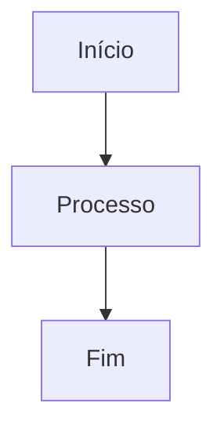

# 📚 Documentação da API de Reservas

Esta documentação foi criada especificamente para o projeto **API de Reservas** - um sistema completo de gerenciamento de reservas para restaurantes desenvolvido com **NestJS** e **MongoDB**.

## 🎯 Sobre o Projeto

**Nome do Projeto**: API de Reservas  
**Descrição**: Sistema completo de gerenciamento de reservas para restaurantes com atribuição automática de mesas e confirmação dupla  
**Framework ODM**: Mongoose  
**Versão do Node.js**: 18.x  
**Versão do NestJS**: 10.x  
**Versão do MongoDB**: 6.x  

## 🏗️ Estrutura da Documentação

### 📁 Organização dos Arquivos

```
docs/
├── intro.md                           # Página inicial da documentação
├── getting-started/
│   ├── environment-setup.md           # Configuração do ambiente
│   └── installation.md                # Guia de instalação
├── architecture/
│   └── module-structure.md            # Estrutura de módulos NestJS
├── database/
│   └── mongodb-integration.md         # Integração com MongoDB
├── authentication/
│   └── overview.md                     # Sistema de autenticação
├── api-reference/
│   ├── overview.md                     # Visão geral das APIs
│   └── reservations.md                # API de reservas (exemplo)
├── testing/
│   └── overview.md                     # Estratégias de testes
├── deployment/
│   └── overview.md                     # Guia de deployment
├── sidebars.ts                         # Configuração de navegação
└── README.md                           # Este arquivo
```

## 🚀 Como Usar Esta Documentação

### 1. **Iniciantes**
Comece pelos guias básicos:
- [Introdução](./intro.md) - Visão geral do projeto
- [Configuração do Ambiente](./getting-started/environment-setup.md)
- [Instalação](./getting-started/installation.md)

### 2. **Desenvolvedores**
Explore a arquitetura e APIs:
- [Estrutura de Módulos](./architecture/module-structure.md)
- [Integração com MongoDB](./database/mongodb-integration.md)
- [Referência da API](./api-reference/overview.md)

### 3. **DevOps/Administradores**
Foque em deployment e testes:
- [Estratégias de Testes](./testing/overview.md)
- [Deployment](./deployment/overview.md)

## 🛠️ Tecnologias Documentadas

### Backend
- **NestJS 10.x** - Framework Node.js progressivo
- **TypeScript** - Linguagem de programação
- **MongoDB 6.x** - Banco de dados NoSQL
- **Mongoose 8.x** - ODM para MongoDB

### Autenticação & Segurança
- **JWT** - JSON Web Tokens
- **bcrypt** - Hash de senhas
- **Guards personalizados** - Proteção de rotas

### Funcionalidades Principais
- **Atribuição automática de mesas**
- **Sistema de confirmação dupla**
- **API RESTful completa**
- **Documentação Swagger automática**

## 📊 Diagramas Incluídos

A documentação inclui diversos diagramas **Mermaid** para visualização:

- **Diagrama de Componentes** - Visão geral da arquitetura
- **Diagrama de Módulos** - Dependências entre módulos NestJS
- **Diagrama de Relacionamentos** - Estrutura do banco de dados
- **Fluxos de Autenticação** - Processo de login/logout
- **Fluxos de Requisição** - Caminho das requisições HTTP

## 🔧 Para Desenvolvedores Docusaurus

### Executar Localmente

```bash
# Instalar Docusaurus (se não tiver)
npx create-docusaurus@latest docs-site classic --typescript

# Copiar arquivos desta documentação para docs-site/docs/
cp -r docs/* docs-site/docs/
cp docs/sidebars.ts docs-site/sidebars.ts

# Navegar para o diretório e instalar dependências
cd docs-site
npm install

# Executar em modo desenvolvimento
npm start
```

### Configurações Necessárias

1. **Habilitar Mermaid** no `docusaurus.config.js`:

```javascript
module.exports = {
  // ... outras configurações
  markdown: {
    mermaid: true,
  },
  themes: ['@docusaurus/theme-mermaid'],
};
```

2. **Configurar tema** para melhor visualização dos diagramas:

```javascript
module.exports = {
  themeConfig: {
    mermaid: {
      theme: {light: 'neutral', dark: 'dark'},
    },
  },
};
```

## 📝 Expandindo a Documentação

### Adicionando Novos Módulos de API

Para adicionar documentação de outros endpoints (users, companies, restaurants, tables):

1. Crie o arquivo na pasta `api-reference/`
2. Siga o padrão estabelecido em `reservations.md`
3. Adicione a referência no `sidebars.ts`

### Exemplo de Estrutura para Novo Endpoint:

```markdown
---
sidebar_position: 3
---

# API de [Nome do Módulo]

## 📋 Visão Geral
## 🎯 Base URL
## 🚀 Endpoints
### 1. Listar [Recursos]
### 2. Criar [Recurso]
### 3. Atualizar [Recurso]
### 4. Remover [Recurso]
## 🛡️ Permissões e Autenticação
## ⚠️ Regras de Negócio
```

### Adicionando Diagramas

Use a sintaxe Mermaid dentro de blocos de código:



## 🎨 Personalização

### Tema e Estilo
- A documentação usa emojis para facilitar navegação
- Seções expansíveis para melhor organização
- Códigos de exemplo com syntax highlighting
- Diagramas interativos com Mermaid

### Convenções
- **Títulos**: Usam emojis temáticos
- **Códigos**: Sempre com linguagem especificada
- **Links**: Relativos para navegação interna
- **Exemplos**: Dados realistas e consistentes

## 🤝 Contribuindo

Para contribuir com a documentação:

1. Mantenha a consistência de formato
2. Use exemplos práticos e realistas
3. Inclua diagramas quando apropriado
4. Teste os códigos de exemplo
5. Siga as convenções estabelecidas

## 📞 Suporte

Esta documentação foi criada como um template completo para projetos NestJS com MongoDB. Para dúvidas específicas sobre implementação, consulte:

- [Documentação oficial do NestJS](https://docs.nestjs.com/)
- [Documentação do MongoDB](https://docs.mongodb.com/)
- [Documentação do Mongoose](https://mongoosejs.com/)
- [Documentação do Docusaurus](https://docusaurus.io/)

---

**Gerado por**: Especialista em Documentação Técnica e NestJS  
**Data**: Janeiro 2024  
**Versão**: 1.0.0 