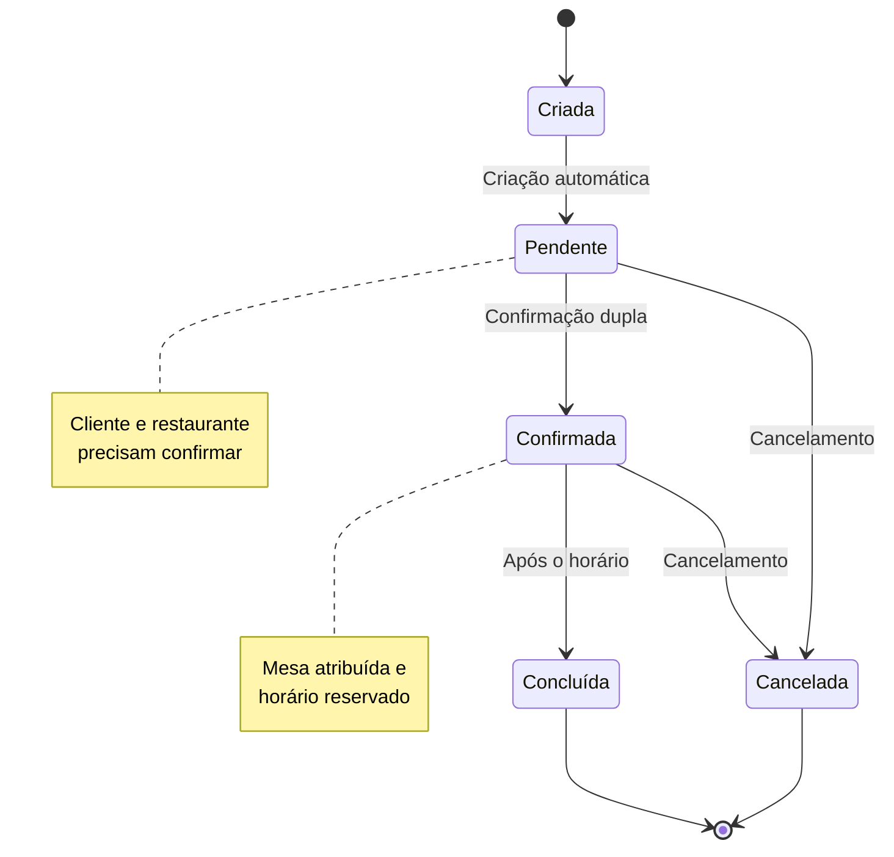

# API de Reservas

Este documento detalha todos os endpoints relacionados ao módulo de reservas, incluindo criação, consulta, atualização e confirmação de reservas.

## 📋 Visão Geral

O módulo de reservas é o coração do sistema, permitindo:
- ✅ **Criação automática de reservas** com atribuição de mesa
- 🔍 **Consulta de disponibilidade** em tempo real
- ✉️ **Sistema de confirmação dupla** (cliente e restaurante)
- 📊 **Relatórios e estatísticas** de reservas

## 🎯 Base URL

```
/api/reserve
```

## 🚀 Endpoints

### 1. Criar Nova Reserva

**POST** `/api/reserve`

Cria uma nova reserva com atribuição automática de mesa baseada na disponibilidade.

#### Headers
```http
Content-Type: application/json
Cookie: sessionToken=... (opcional para clientes)
```

#### Request Body

```json
{
  "restaurantId": "507f1f77bcf86cd799439011",
  "customerName": "João Silva",
  "customerEmail": "joao@email.com",
  "customerPhone": "+5511999999999",
  "date": "2024-02-15",
  "time": "19:30",
  "numberOfPeople": 4,
  "specialRequests": "Mesa próxima à janela, aniversário"
}
```

#### Response (201 Created)

```json
{
  "data": {
    "id": "507f1f77bcf86cd799439022",
    "restaurantId": "507f1f77bcf86cd799439011",
    "tableId": "507f1f77bcf86cd799439033",
    "customerName": "João Silva",
    "customerEmail": "joao@email.com",
    "customerPhone": "+5511999999999",
    "date": "2024-02-15T00:00:00.000Z",
    "time": "19:30",
    "numberOfPeople": 4,
    "specialRequests": "Mesa próxima à janela, aniversário",
    "status": "pending",
    "confirmation": {
      "clientConfirmed": false,
      "restaurantConfirmed": false
    },
    "table": {
      "id": "507f1f77bcf86cd799439033",
      "number": "12",
      "capacity": 6,
      "location": "janela"
    },
    "createdAt": "2024-01-15T10:30:00.000Z",
    "updatedAt": "2024-01-15T10:30:00.000Z"
  },
  "message": "Reserva criada com sucesso. Mesa atribuída automaticamente."
}
```

#### Response (409 Conflict)

```json
{
  "error": {
    "code": "NO_TABLES_AVAILABLE",
    "message": "Nenhuma mesa disponível para o horário solicitado",
    "details": {
      "date": "2024-02-15",
      "time": "19:30",
      "numberOfPeople": 4,
      "availableAlternatives": [
        {
          "time": "18:30",
          "availableTables": 3
        },
        {
          "time": "20:30",
          "availableTables": 2
        }
      ]
    }
  },
  "timestamp": "2024-01-15T10:30:00.000Z"
}
```

### 2. Listar Reservas

**GET** `/api/reserve`

Lista reservas com filtros opcionais e paginação.

#### Query Parameters

| Parâmetro | Tipo | Descrição | Padrão |
|-----------|------|-----------|--------|
| `page` | number | Página atual | 1 |
| `limit` | number | Itens por página | 10 |
| `restaurantId` | string | Filtrar por restaurante | - |
| `status` | string | Filtrar por status | - |
| `date` | string | Filtrar por data (YYYY-MM-DD) | - |
| `customerEmail` | string | Filtrar por email do cliente | - |

#### Exemplo de Request

```bash
GET /api/reserve?restaurantId=507f1f77bcf86cd799439011&status=confirmed&page=1&limit=20
```

#### Response (200 OK)

```json
{
  "data": [
    {
      "id": "507f1f77bcf86cd799439022",
      "customerName": "João Silva",
      "customerEmail": "joao@email.com",
      "date": "2024-02-15T00:00:00.000Z",
      "time": "19:30",
      "numberOfPeople": 4,
      "status": "confirmed",
      "table": {
        "number": "12",
        "capacity": 6
      },
      "restaurant": {
        "name": "Restaurante Exemplo"
      },
      "createdAt": "2024-01-15T10:30:00.000Z"
    }
  ],
  "meta": {
    "total": 150,
    "page": 1,
    "limit": 20,
    "totalPages": 8
  }
}
```

### 3. Buscar Reserva por ID

**GET** `/api/reserve/{id}`

Busca uma reserva específica pelo ID.

#### Response (200 OK)

```json
{
  "data": {
    "id": "507f1f77bcf86cd799439022",
    "restaurantId": "507f1f77bcf86cd799439011",
    "tableId": "507f1f77bcf86cd799439033",
    "customerName": "João Silva",
    "customerEmail": "joao@email.com",
    "customerPhone": "+5511999999999",
    "date": "2024-02-15T00:00:00.000Z",
    "time": "19:30",
    "numberOfPeople": 4,
    "specialRequests": "Mesa próxima à janela, aniversário",
    "status": "confirmed",
    "confirmation": {
      "clientConfirmed": true,
      "restaurantConfirmed": true,
      "confirmedAt": "2024-01-15T11:00:00.000Z"
    },
    "table": {
      "id": "507f1f77bcf86cd799439033",
      "number": "12",
      "capacity": 6,
      "location": "janela"
    },
    "restaurant": {
      "id": "507f1f77bcf86cd799439011",
      "name": "Restaurante Exemplo",
      "phone": "+5511888888888"
    },
    "createdAt": "2024-01-15T10:30:00.000Z",
    "updatedAt": "2024-01-15T11:00:00.000Z"
  }
}
```

### 4. Confirmar Reserva

**PATCH** `/api/reserve/confirm/{type}/{id}`

Confirma uma reserva. Pode ser confirmada pelo cliente ou pelo restaurante.

#### Parameters

| Parâmetro | Tipo | Descrição |
|-----------|------|-----------|
| `type` | string | `client` ou `restaurant` |
| `id` | string | ID da reserva |

#### Headers
```http
Cookie: sessionToken=... (obrigatório)
```

#### Response (200 OK)

```json
{
  "data": {
    "id": "507f1f77bcf86cd799439022",
    "status": "confirmed",
    "confirmation": {
      "clientConfirmed": true,
      "restaurantConfirmed": true,
      "confirmedAt": "2024-01-15T11:00:00.000Z"
    },
    "updatedAt": "2024-01-15T11:00:00.000Z"
  },
  "message": "Reserva confirmada com sucesso"
}
```

### 5. Atualizar Reserva

**PUT** `/api/reserve/{id}`

Atualiza dados de uma reserva existente.

#### Headers
```http
Content-Type: application/json
Cookie: sessionToken=... (obrigatório)
```

#### Request Body

```json
{
  "customerName": "João Silva Santos",
  "customerPhone": "+5511888888888",
  "numberOfPeople": 6,
  "specialRequests": "Mesa próxima à janela, aniversário - 6 pessoas",
  "notes": "Cliente ligou para alterar número de pessoas"
}
```

#### Response (200 OK)

```json
{
  "data": {
    "id": "507f1f77bcf86cd799439022",
    "customerName": "João Silva Santos",
    "customerPhone": "+5511888888888",
    "numberOfPeople": 6,
    "specialRequests": "Mesa próxima à janela, aniversário - 6 pessoas",
    "notes": "Cliente ligou para alterar número de pessoas",
    "updatedAt": "2024-01-15T12:00:00.000Z"
  },
  "message": "Reserva atualizada com sucesso"
}
```

### 6. Cancelar Reserva

**DELETE** `/api/reserve/{id}`

Cancela uma reserva (soft delete).

#### Headers
```http
Cookie: sessionToken=... (obrigatório)
```

#### Response (200 OK)

```json
{
  "data": {
    "id": "507f1f77bcf86cd799439022",
    "status": "cancelled",
    "cancelledAt": "2024-01-15T13:00:00.000Z"
  },
  "message": "Reserva cancelada com sucesso"
}
```

### 7. Verificar Disponibilidade

**GET** `/api/reserve/availability/{restaurantId}`

Verifica horários disponíveis para um restaurante em uma data específica.

#### Query Parameters

| Parâmetro | Tipo | Descrição | Obrigatório |
|-----------|------|-----------|-------------|
| `date` | string | Data (YYYY-MM-DD) | ✅ |
| `numberOfPeople` | number | Número de pessoas | ✅ |

#### Exemplo de Request

```bash
GET /api/reserve/availability/507f1f77bcf86cd799439011?date=2024-02-15&numberOfPeople=4
```

#### Response (200 OK)

```json
{
  "data": {
    "date": "2024-02-15",
    "numberOfPeople": 4,
    "availableSlots": [
      {
        "time": "18:00",
        "availableTables": 3,
        "tables": [
          {
            "id": "507f1f77bcf86cd799439033",
            "number": "12",
            "capacity": 6,
            "location": "janela"
          },
          {
            "id": "507f1f77bcf86cd799439034",
            "number": "8",
            "capacity": 4,
            "location": "centro"
          }
        ]
      },
      {
        "time": "18:30",
        "availableTables": 2,
        "tables": [...]
      },
      {
        "time": "19:00",
        "availableTables": 1,
        "tables": [...]
      }
    ],
    "unavailableSlots": [
      {
        "time": "19:30",
        "reason": "Todas as mesas ocupadas"
      },
      {
        "time": "20:00",
        "reason": "Todas as mesas ocupadas"
      }
    ]
  }
}
```

### 8. Relatório de Reservas

**GET** `/api/reserve/reports/stats`

Gera relatórios e estatísticas de reservas.

#### Headers
```http
Cookie: sessionToken=... (obrigatório)
Authorization: Bearer ... (alternativo)
```

#### Query Parameters

| Parâmetro | Tipo | Descrição |
|-----------|------|-----------|
| `restaurantId` | string | ID do restaurante |
| `startDate` | string | Data inicial (YYYY-MM-DD) |
| `endDate` | string | Data final (YYYY-MM-DD) |
| `groupBy` | string | `day`, `week`, `month` |

#### Response (200 OK)

```json
{
  "data": {
    "period": {
      "startDate": "2024-01-01",
      "endDate": "2024-01-31"
    },
    "summary": {
      "totalReservations": 145,
      "confirmedReservations": 132,
      "cancelledReservations": 13,
      "totalGuests": 580,
      "averagePartySize": 4.2,
      "occupancyRate": 78.5
    },
    "dailyStats": [
      {
        "date": "2024-01-01",
        "reservations": 12,
        "confirmed": 11,
        "cancelled": 1,
        "guests": 48
      }
    ],
    "statusBreakdown": {
      "pending": 8,
      "confirmed": 132,
      "cancelled": 13,
      "completed": 120
    }
  }
}
```

## 🔄 Fluxo da Reserva



## 📊 Status de Reserva

| Status | Descrição | Ações Permitidas |
|--------|-----------|------------------|
| `pending` | Aguardando confirmação | Confirmar, Cancelar, Editar |
| `confirmed` | Confirmada por ambas as partes | Cancelar, Concluir |
| `cancelled` | Cancelada | Visualizar apenas |
| `completed` | Concluída (após o horário) | Visualizar apenas |
| `no-show` | Cliente não compareceu | Visualizar apenas |

## 🛡️ Permissões e Autenticação

### Endpoints Públicos
- ✅ `GET /api/reserve/availability/{restaurantId}` - Verificar disponibilidade

### Endpoints Autenticados
- 🔐 `POST /api/reserve` - Criar reserva (opcional para clientes)
- 🔐 `GET /api/reserve` - Listar reservas (filtradas por usuário)
- 🔐 `PATCH /api/reserve/confirm/{type}/{id}` - Confirmar reserva

### Endpoints Administrativos
- 👑 `GET /api/reserve/reports/stats` - Relatórios (restaurant_admin, company_admin)
- 👑 `PUT /api/reserve/{id}` - Editar reserva (restaurant_admin)
- 👑 `DELETE /api/reserve/{id}` - Cancelar reserva (restaurant_admin)

## ⚠️ Regras de Negócio

### Criação de Reserva

1. **Data válida**: Não pode ser no passado
2. **Horário de funcionamento**: Deve estar dentro do horário do restaurante
3. **Capacidade**: Número de pessoas entre 1 e 20
4. **Disponibilidade**: Mesa disponível no horário solicitado
5. **Antecedência mínima**: 30 minutos antes do horário

### Confirmação de Reserva

1. **Dupla confirmação**: Cliente E restaurante devem confirmar
2. **Prazo**: Confirmação deve ocorrer até 2 horas antes do horário
3. **Status**: Apenas reservas "pending" podem ser confirmadas

### Cancelamento

1. **Prazo**: Até 1 hora antes do horário agendado
2. **Penalidade**: Cancelamentos de última hora podem gerar penalidade
3. **Liberação**: Mesa fica disponível imediatamente após cancelamento

## 🚀 Próximos Passos

<!-- - [API de Restaurantes](./restaurants) -->
<!-- - [API de Mesas](./tables) -->
<!-- - [API de Usuários](./users) -->

## 📚 Links Relacionados

<!-- - [API de Restaurantes](./restaurants) -->
<!-- - [API de Mesas](./tables) -->
<!-- - [API de Usuários](./users) -->

### Referências Externas

- [🔐 Sistema de Autenticação](../authentication/overview)
- [🏗️ Arquitetura do Sistema](../architecture/module-structure) 