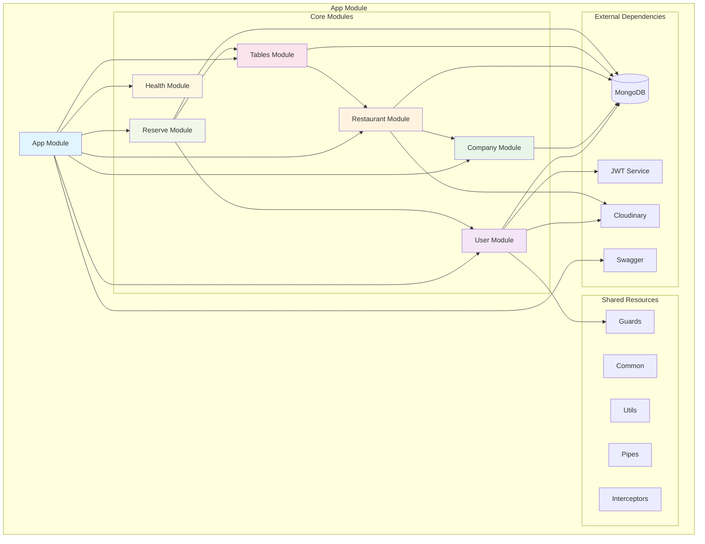
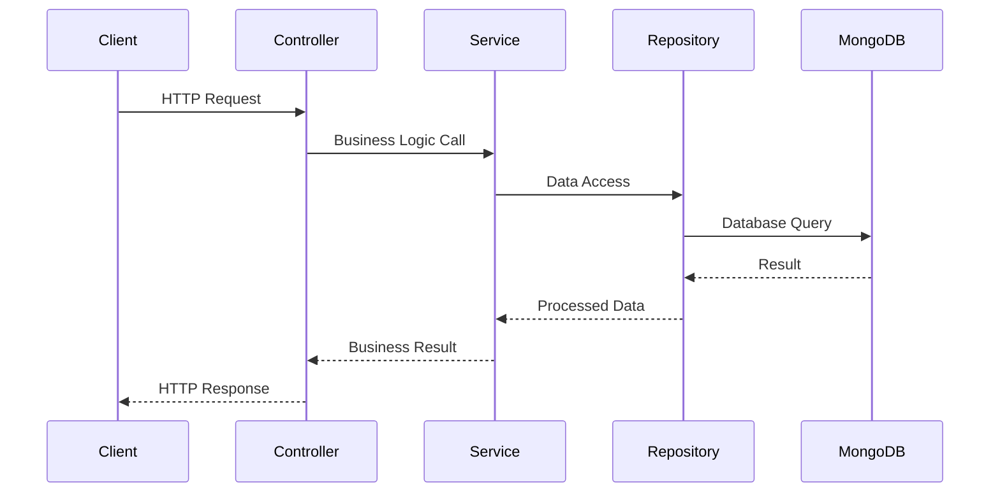
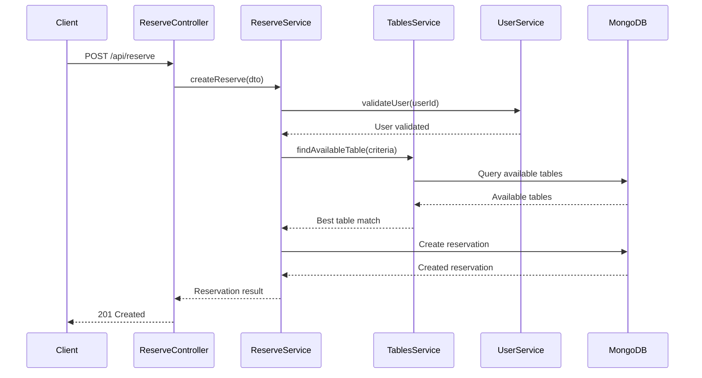

# Estrutura de Módulos e Componentes

Este documento explica a arquitetura modular do sistema de reservas, detalhando como os módulos NestJS interagem e organizam a aplicação.

## 🏗️ Visão Geral da Arquitetura

A API de Reservas segue os princípios de **arquitetura modular** do NestJS, onde cada módulo encapsula funcionalidades específicas e relacionadas.

### Princípios Aplicados

- **Separação de Responsabilidades** - Cada módulo tem uma responsabilidade bem definida
- **Baixo Acoplamento** - Módulos são independentes e comunicam-se através de interfaces bem definidas
- **Alta Coesão** - Componentes relacionados ficam agrupados no mesmo módulo
- **Injeção de Dependência** - Facilitada pelo sistema de DI do NestJS

## 📂 Estrutura de Módulos

```
src/
├── modules/
│   ├── user/               # Gestão de usuários e autenticação
│   ├── company/            # Gestão de empresas
│   ├── restaurant/         # Gestão de restaurantes
│   ├── tables/             # Gestão de mesas
│   ├── reserve/            # Gestão de reservas
│   └── health/             # Health checks e monitoramento
├── common/                 # Recursos compartilhados
├── util/                   # Utilitários globais
├── app.module.ts          # Módulo raiz
└── main.ts                # Bootstrap da aplicação
```

## 🧩 Diagrama de Módulos



## 📋 Detalhamento dos Módulos

### 👤 User Module

**Responsabilidade**: Gestão de usuários e autenticação

```typescript
@Module({
  imports: [
    MongooseModule.forFeature([{ name: User.name, schema: UserSchema }]),
    JwtModule.register({
      secret: process.env.JWT_SECRET,
      signOptions: { expiresIn: process.env.JWT_EXPIRES_IN },
    }),
  ],
  controllers: [AuthUserController, UserController],
  providers: [AuthUserService, UserService, UserGuard],
  exports: [UserService, AuthUserService],
})
export class UserModule {}
```

**Componentes**:
- **Controllers**: `AuthUserController`, `UserController`
- **Services**: `AuthUserService`, `UserService`
- **Guards**: `UserGuard`
- **DTOs**: `AuthUserDto`, `CreateUserDto`, `UpdateUserDto`
- **Schemas**: `UserSchema`

### 🏢 Company Module

**Responsabilidade**: Gestão de empresas proprietárias de restaurantes

```typescript
@Module({
  imports: [
    MongooseModule.forFeature([{ name: Company.name, schema: CompanySchema }]),
  ],
  controllers: [CompanyController],
  providers: [CompanyService],
  exports: [CompanyService],
})
export class CompanyModule {}
```

**Componentes**:
- **Controllers**: `CompanyController`
- **Services**: `CompanyService`
- **DTOs**: `CreateCompanyDto`, `UpdateCompanyDto`
- **Schemas**: `CompanySchema`

### 🍽️ Restaurant Module

**Responsabilidade**: Gestão de restaurantes

```typescript
@Module({
  imports: [
    MongooseModule.forFeature([{ name: Restaurant.name, schema: RestaurantSchema }]),
    CompanyModule,
  ],
  controllers: [RestaurantController],
  providers: [RestaurantService],
  exports: [RestaurantService],
})
export class RestaurantModule {}
```

**Componentes**:
- **Controllers**: `RestaurantController`
- **Services**: `RestaurantService`
- **DTOs**: `CreateRestaurantDto`, `UpdateRestaurantDto`
- **Schemas**: `RestaurantSchema`

### 🪑 Tables Module

**Responsabilidade**: Gestão de mesas dos restaurantes

```typescript
@Module({
  imports: [
    MongooseModule.forFeature([{ name: Table.name, schema: TableSchema }]),
    RestaurantModule,
  ],
  controllers: [TablesController],
  providers: [TablesService],
  exports: [TablesService],
})
export class TablesModule {}
```

**Componentes**:
- **Controllers**: `TablesController`
- **Services**: `TablesService`
- **DTOs**: `CreateTableDto`, `UpdateTableDto`
- **Schemas**: `TableSchema`

### 📅 Reserve Module

**Responsabilidade**: Gestão de reservas (módulo principal)

```typescript
@Module({
  imports: [
    MongooseModule.forFeature([{ name: Reserve.name, schema: ReserveSchema }]),
    TablesModule,
    UserModule,
    RestaurantModule,
  ],
  controllers: [ReserveController],
  providers: [ReserveService],
  exports: [ReserveService],
})
export class ReserveModule {}
```

**Componentes**:
- **Controllers**: `ReserveController`
- **Services**: `ReserveService`
- **DTOs**: `CreateReserveDto`, `UpdateReserveDto`, `ConfirmReserveDto`
- **Schemas**: `ReserveSchema`

### 🏥 Health Module

**Responsabilidade**: Monitoramento e health checks

```typescript
@Module({
  controllers: [HealthController],
  providers: [HealthService],
})
export class HealthModule {}
```

## 🔄 Padrões de Interação

### Controller → Service → Repository



### Exemplo Prático: Criar Reserva



## 🛡️ Componentes Transversais

### Guards

```typescript
// user.guard.ts
@Injectable()
export class UserGuard implements CanActivate {
  constructor(private jwtService: JwtService) {}

  canActivate(context: ExecutionContext): boolean {
    const request = context.switchToHttp().getRequest();
    const token = this.extractTokenFromCookie(request);
    
    try {
      const payload = this.jwtService.verify(token);
      request.user = payload;
      return true;
    } catch {
      throw new UnauthorizedException();
    }
  }
}
```

### Pipes de Validação

```typescript
// Aplicação global de pipes
app.useGlobalPipes(new ValidationPipe({
  whitelist: true,
  forbidNonWhitelisted: true,
  transform: true,
}));
```

### Interceptors

```typescript
@Injectable()
export class LoggingInterceptor implements NestInterceptor {
  intercept(context: ExecutionContext, next: CallHandler): Observable<any> {
    const req = context.switchToHttp().getRequest();
    const method = req.method;
    const url = req.url;
    
    const now = Date.now();
    return next.handle().pipe(
      tap(() => console.log(`${method} ${url} ${Date.now() - now}ms`)),
    );
  }
}
```

## 📊 DTOs e Validação

### Exemplo de DTO com Validação

```typescript
// create-reserve.dto.ts
export class CreateReserveDto {
  @IsNotEmpty()
  @IsString()
  customerName: string;

  @IsEmail()
  customerEmail: string;

  @IsNotEmpty()
  @IsDateString()
  date: string;

  @IsNotEmpty()
  @IsString()
  time: string;

  @IsNumber()
  @Min(1)
  @Max(20)
  numberOfPeople: number;

  @IsOptional()
  @IsString()
  specialRequests?: string;
}
```

## 🔧 Configuração de Módulos

### App Module Principal

```typescript
@Module({
  imports: [
    ConfigModule.forRoot({
      isGlobal: true,
    }),
    MongooseModule.forRoot(process.env.MONGODB_URI),
    UserModule,
    CompanyModule,
    RestaurantModule,
    TablesModule,
    ReserveModule,
    HealthModule,
  ],
  controllers: [],
  providers: [],
})
export class AppModule {}
```

## 🎯 Benefícios da Arquitetura Modular

1. **Manutenibilidade**: Cada módulo pode ser modificado independentemente
2. **Testabilidade**: Módulos podem ser testados isoladamente
3. **Escalabilidade**: Novos módulos podem ser adicionados facilmente
4. **Reutilização**: Serviços podem ser exportados e reutilizados
5. **Separação de Responsabilidades**: Cada módulo tem um propósito específico

## 🚀 Próximos Passos

- [Integração com MongoDB](../database/mongodb-integration)
- [Sistema de Autenticação](../authentication/overview)
- [APIs RESTful](../api-reference/overview) 