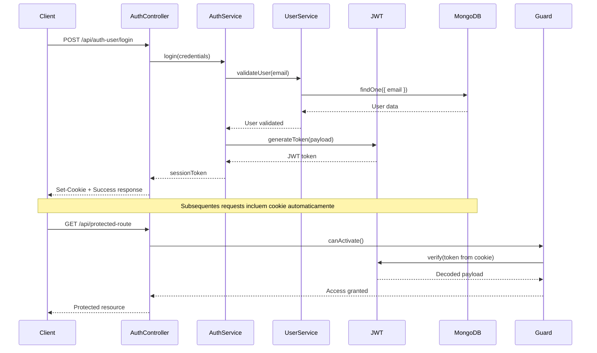

# Autenticação e Autorização

Este documento detalha o sistema de autenticação e autorização da API de Reservas, incluindo JWT, guards e estratégias de segurança.

## 🔐 Visão Geral do Sistema

A API utiliza **JSON Web Tokens (JWT)** para autenticação, com cookies HTTP-only para maior segurança. O sistema suporta diferentes tipos de usuários com permissões específicas.

### Fluxo de Autenticação



## 🛡️ Implementação da Autenticação

### Auth Service

```typescript
// auth-user.service.ts
@Injectable()
export class AuthUserService {
  constructor(
    @InjectModel(User.name) private userModel: Model<UserDocument>,
    private jwtService: JwtService,
  ) {}

  async login(authUserDto: AuthUserDto): Promise<{ sessionToken: string }> {
    const { email, password } = authUserDto;

    // Buscar usuário pelo email
    const user = await this.userModel.findOne({ email }).exec();
    if (!user) {
      throw new UnauthorizedException('Credenciais inválidas');
    }

    // Verificar senha
    const isPasswordValid = await bcrypt.compare(password, user.password);
    if (!isPasswordValid) {
      throw new UnauthorizedException('Credenciais inválidas');
    }

    // Verificar se usuário está ativo
    if (!user.isActive) {
      throw new UnauthorizedException('Usuário inativo');
    }

    // Gerar JWT token
    const payload = {
      sub: user._id,
      email: user.email,
      role: user.role,
      name: user.name,
    };

    const sessionToken = this.jwtService.sign(payload);

    return { sessionToken };
  }

  async validateToken(token: string): Promise<any> {
    try {
      return this.jwtService.verify(token);
    } catch (error) {
      throw new UnauthorizedException('Token inválido');
    }
  }
}
```

### Auth Controller

```typescript
// auth-user.controller.ts
@ApiTags('Users')
@Controller('auth-user')
export class AuthUserController {
  constructor(private readonly authService: AuthUserService) {}

  @Post('/login')
  @ApiOperation({
    summary: 'Login de usuário',
    description: 'Autentica um usuário usando email e senha',
  })
  @ApiBody({ type: AuthUserDto })
  @ApiResponse({
    status: 200,
    description: 'Login realizado com sucesso',
  })
  async login(@Body() user: AuthUserDto, @Res() response: Response) {
    const { sessionToken } = await this.authService.login(user);

    // Configurar cookie seguro
    response.cookie('sessionToken', sessionToken, {
      maxAge: 7 * 24 * 60 * 60 * 1000, // 7 dias
      path: '/',
      secure: process.env.NODE_ENV === 'production',
      httpOnly: true,
      sameSite: process.env.NODE_ENV === 'production' ? 'none' : 'lax',
    });

    return response.status(HttpStatus.OK).json({
      message: 'Login realizado com sucesso',
    });
  }

  @UseGuards(UserGuard)
  @Get('/logout')
  @ApiBearerAuth('JWT-auth')
  async logout(@Res() response: Response) {
    response.clearCookie('sessionToken', {
      path: '/',
      secure: process.env.NODE_ENV === 'production',
      httpOnly: true,
      sameSite: process.env.NODE_ENV === 'production' ? 'none' : 'lax',
    });

    return response.status(HttpStatus.OK).json({
      message: 'Logout realizado com sucesso',
    });
  }
}
```

## 🛡️ Guards de Segurança

### User Guard

```typescript
// user.guard.ts
@Injectable()
export class UserGuard implements CanActivate {
  constructor(private jwtService: JwtService) {}

  canActivate(context: ExecutionContext): boolean | Promise<boolean> {
    const request = context.switchToHttp().getRequest();
    const token = this.extractTokenFromCookie(request);

    if (!token) {
      throw new UnauthorizedException('Token não encontrado');
    }

    try {
      const payload = this.jwtService.verify(token, {
        secret: process.env.JWT_SECRET,
      });
      
      // Adicionar dados do usuário ao request
      request.user = payload;
      return true;
    } catch (error) {
      throw new UnauthorizedException('Token inválido ou expirado');
    }
  }

  private extractTokenFromCookie(request: any): string | undefined {
    return request.cookies?.sessionToken;
  }
}
```

### Role Guard (Controle de Acesso Baseado em Função)

```typescript
// roles.guard.ts
@Injectable()
export class RolesGuard implements CanActivate {
  constructor(private reflector: Reflector) {}

  canActivate(context: ExecutionContext): boolean {
    const requiredRoles = this.reflector.getAllAndOverride<string[]>(
      'roles',
      [context.getHandler(), context.getClass()]
    );

    if (!requiredRoles) {
      return true;
    }

    const request = context.switchToHttp().getRequest();
    const user = request.user;

    if (!user) {
      throw new UnauthorizedException('Usuário não autenticado');
    }

    const hasRole = requiredRoles.some(role => user.role === role);
    
    if (!hasRole) {
      throw new ForbiddenException('Acesso negado: permissão insuficiente');
    }

    return true;
  }
}
```

### Decorator para Roles

```typescript
// roles.decorator.ts
import { SetMetadata } from '@nestjs/common';

export const Roles = (...roles: string[]) => SetMetadata('roles', roles);
```

## 🔒 DTOs e Validação

### Auth User DTO

```typescript
// auth-user.dto.ts
import { ApiProperty } from '@nestjs/swagger';
import { IsEmail, IsNotEmpty, IsString, MinLength } from 'class-validator';

export class AuthUserDto {
  @ApiProperty({
    description: 'Email do usuário',
    example: 'usuario@email.com',
  })
  @IsEmail({}, { message: 'Email deve ter um formato válido' })
  @IsNotEmpty({ message: 'Email é obrigatório' })
  email: string;

  @ApiProperty({
    description: 'Senha do usuário',
    example: 'MinhaSenh@123',
    minLength: 6,
  })
  @IsString({ message: 'Senha deve ser uma string' })
  @IsNotEmpty({ message: 'Senha é obrigatória' })
  @MinLength(6, { message: 'Senha deve ter pelo menos 6 caracteres' })
  password: string;
}
```

### Create User DTO

```typescript
// create-user.dto.ts
export class CreateUserDto {
  @ApiProperty({ description: 'Nome completo do usuário' })
  @IsString()
  @IsNotEmpty()
  name: string;

  @ApiProperty({ description: 'Email único do usuário' })
  @IsEmail()
  @IsNotEmpty()
  email: string;

  @ApiProperty({ description: 'Senha do usuário', minLength: 6 })
  @IsString()
  @MinLength(6)
  password: string;

  @ApiProperty({ 
    description: 'Função do usuário',
    enum: ['client', 'restaurant_admin', 'company_admin'],
    default: 'client'
  })
  @IsOptional()
  @IsIn(['client', 'restaurant_admin', 'company_admin'])
  role?: string;

  @ApiProperty({ description: 'Telefone do usuário', required: false })
  @IsOptional()
  @IsString()
  phone?: string;
}
```

## 🎯 Configuração JWT

### JWT Module Configuration

```typescript
// user.module.ts
@Module({
  imports: [
    MongooseModule.forFeature([{ name: User.name, schema: UserSchema }]),
    JwtModule.register({
      secret: process.env.JWT_SECRET,
      signOptions: { 
        expiresIn: process.env.JWT_EXPIRES_IN || '7d',
      },
    }),
  ],
  controllers: [AuthUserController, UserController],
  providers: [AuthUserService, UserService, UserGuard],
  exports: [UserService, AuthUserService, UserGuard],
})
export class UserModule {}
```

### Configuração Global de Guards

```typescript
// main.ts
async function bootstrap() {
  const app = await NestFactory.create(AppModule);

  // Configurar guards globais se necessário
  app.useGlobalGuards(new RolesGuard(app.get(Reflector)));

  // Outras configurações...
}
```

## 🔐 Uso em Controllers

### Protegendo Rotas

```typescript
// reserve.controller.ts
@Controller('reserve')
@ApiTags('Reservas')
export class ReserveController {
  constructor(private readonly reserveService: ReserveService) {}

  // Rota pública
  @Get('/available-times/:restaurantId')
  async getAvailableTimes(@Param('restaurantId') restaurantId: string) {
    return this.reserveService.getAvailableTimes(restaurantId);
  }

  // Rota protegida - qualquer usuário autenticado
  @UseGuards(UserGuard)
  @Post()
  @ApiBearerAuth('JWT-auth')
  async create(
    @Body() createReserveDto: CreateReserveDto,
    @Request() req,
  ) {
    // req.user contém os dados do usuário autenticado
    return this.reserveService.create(createReserveDto, req.user);
  }

  // Rota com controle de acesso por role
  @UseGuards(UserGuard, RolesGuard)
  @Roles('restaurant_admin', 'company_admin')
  @Get('/admin/all')
  @ApiBearerAuth('JWT-auth')
  async getAllReservations(@Request() req) {
    return this.reserveService.getAllForAdmin(req.user);
  }

  // Confirmação de reserva - múltiplas roles
  @UseGuards(UserGuard, RolesGuard)
  @Roles('client', 'restaurant_admin')
  @Patch('/confirm/:type/:id')
  @ApiBearerAuth('JWT-auth')
  async confirmReservation(
    @Param('type') type: 'client' | 'restaurant',
    @Param('id') id: string,
    @Request() req,
  ) {
    return this.reserveService.confirmReservation(id, type, req.user);
  }
}
```

## 🔄 Refresh Token (Opcional)

### Implementação de Refresh Token

```typescript
// Estender AuthService para incluir refresh tokens
@Injectable()
export class AuthUserService {
  async login(authUserDto: AuthUserDto): Promise<{
    accessToken: string;
    refreshToken: string;
  }> {
    // ... validação do usuário

    const payload = { sub: user._id, email: user.email, role: user.role };
    
    const accessToken = this.jwtService.sign(payload, { expiresIn: '15m' });
    const refreshToken = this.jwtService.sign(payload, { expiresIn: '7d' });

    // Salvar refresh token no banco de dados
    await this.userModel.findByIdAndUpdate(user._id, {
      refreshToken: await bcrypt.hash(refreshToken, 10),
    });

    return { accessToken, refreshToken };
  }

  async refreshToken(refreshToken: string): Promise<{ accessToken: string }> {
    try {
      const payload = this.jwtService.verify(refreshToken);
      const user = await this.userModel.findById(payload.sub);

      if (!user || !user.refreshToken) {
        throw new UnauthorizedException('Refresh token inválido');
      }

      const isRefreshTokenValid = await bcrypt.compare(
        refreshToken,
        user.refreshToken,
      );

      if (!isRefreshTokenValid) {
        throw new UnauthorizedException('Refresh token inválido');
      }

      const newPayload = {
        sub: user._id,
        email: user.email,
        role: user.role,
      };

      const accessToken = this.jwtService.sign(newPayload, { expiresIn: '15m' });

      return { accessToken };
    } catch (error) {
      throw new UnauthorizedException('Refresh token inválido ou expirado');
    }
  }
}
```

## 🛡️ Middlewares de Segurança

### Rate Limiting

```typescript
// rate-limit.middleware.ts
@Injectable()
export class RateLimitMiddleware implements NestMiddleware {
  private attempts = new Map<string, { count: number; lastAttempt: Date }>();

  use(req: any, res: any, next: () => void) {
    const ip = req.ip;
    const now = new Date();
    const windowMs = 15 * 60 * 1000; // 15 minutos
    const maxAttempts = 5;

    const userAttempts = this.attempts.get(ip);

    if (userAttempts) {
      const timeDiff = now.getTime() - userAttempts.lastAttempt.getTime();
      
      if (timeDiff > windowMs) {
        // Reset window
        this.attempts.set(ip, { count: 1, lastAttempt: now });
      } else if (userAttempts.count >= maxAttempts) {
        throw new TooManyRequestsException(
          'Muitas tentativas. Tente novamente em 15 minutos.',
        );
      } else {
        this.attempts.set(ip, {
          count: userAttempts.count + 1,
          lastAttempt: now,
        });
      }
    } else {
      this.attempts.set(ip, { count: 1, lastAttempt: now });
    }

    next();
  }
}
```

## 📊 Monitoramento e Logs

### Log de Autenticação

```typescript
// auth-logging.interceptor.ts
@Injectable()
export class AuthLoggingInterceptor implements NestInterceptor {
  private readonly logger = new Logger(AuthLoggingInterceptor.name);

  intercept(context: ExecutionContext, next: CallHandler): Observable<any> {
    const request = context.switchToHttp().getRequest();
    const { method, url, ip } = request;
    const userAgent = request.get('user-agent') || '';

    return next.handle().pipe(
      tap(() => {
        this.logger.log(
          `Acesso autorizado - ${method} ${url} - IP: ${ip} - User-Agent: ${userAgent}`,
        );
      }),
      catchError((error) => {
        this.logger.error(
          `Acesso negado - ${method} ${url} - IP: ${ip} - Erro: ${error.message}`,
        );
        throw error;
      }),
    );
  }
}
```

## 🎯 Melhores Práticas de Segurança

### 1. Configuração de Cookies Segura

```typescript
// Produção
response.cookie('sessionToken', token, {
  maxAge: 7 * 24 * 60 * 60 * 1000,
  path: '/',
  secure: true,        // HTTPS apenas
  httpOnly: true,      // Não acessível via JavaScript
  sameSite: 'none',    // Para CORS
});
```

### 2. Validação Rigorosa

```typescript
// Validar formato de email
@IsEmail({}, { message: 'Email deve ter um formato válido' })

// Senha forte
@Matches(/^(?=.*[a-z])(?=.*[A-Z])(?=.*\d)(?=.*[@$!%*?&])[A-Za-z\d@$!%*?&]/, {
  message: 'Senha deve conter pelo menos: 1 maiúscula, 1 minúscula, 1 número e 1 caractere especial',
})
```

### 3. Hash de Senhas Seguro

```typescript
// Usar salt rounds alto
const salt = await bcrypt.genSalt(12);
const hashedPassword = await bcrypt.hash(password, salt);
```

## 🚀 Próximos Passos

- [APIs RESTful](../api-reference/overview)
- [Testes de Autenticação](../testing/authentication-tests)
- [Deployment e Segurança](../deployment/security) 