# Implantação (Deployment)

Este documento detalha as estratégias e processos de implantação da API de Reservas em diferentes ambientes, incluindo Docker, serviços em nuvem e melhores práticas de deployment.

## 🚀 Visão Geral

A API de Reservas suporta múltiplas estratégias de deployment, adaptáveis desde ambientes locais até implantações em larga escala na nuvem.

### Ambientes Suportados

```mermaid
graph TB
    subgraph "Ambientes de Deployment"
        A[Desenvolvimento Local]
        B[Staging/Homologação]
        C[Produção]
    end
    
    subgraph "Plataformas Suportadas"
        D[Docker]
        E[Heroku]
        F[AWS]
        G[DigitalOcean]
        H[Vercel]
        I[Railway]
    end
    
    A --> D
    B --> E
    B --> F
    C --> F
    C --> G
    
    style A fill:#e8f5e8
    style B fill:#fff3e0
    style C fill:#ffebee
```



## 🐳 Docker

### Dockerfile

```dockerfile
# Build stage
FROM node:18-alpine AS builder

WORKDIR /app

# Copiar arquivos de dependência
COPY package.json yarn.lock ./

# Instalar dependências
RUN yarn install --frozen-lockfile

# Copiar código fonte
COPY . .

# Build da aplicação
RUN yarn build

# Production stage
FROM node:18-alpine AS production

WORKDIR /app

# Criar usuário não-root
RUN addgroup -g 1001 -S nodejs
RUN adduser -S nestjs -u 1001

# Copiar arquivos de dependência
COPY package.json yarn.lock ./

# Instalar apenas dependências de produção
RUN yarn install --frozen-lockfile --production

# Copiar aplicação buildada
COPY --from=builder /app/dist ./dist

# Criar diretório para uploads
RUN mkdir -p uploads && chown -R nestjs:nodejs uploads

# Mudar para usuário não-root
USER nestjs

# Expor porta
EXPOSE 3000

# Health check
HEALTHCHECK --interval=30s --timeout=3s --start-period=5s --retries=3 \
  CMD node healthcheck.js

# Comando de inicialização
CMD ["node", "dist/main"]
```

### Docker Compose

```yaml
# docker-compose.yml
version: '3.8'

services:
  app:
    build: .
    ports:
      - "3000:3000"
    environment:
      - NODE_ENV=production
      - PORT=3000
      - MONGODB_URI=mongodb://mongo:27017/reservas
      - JWT_SECRET=${JWT_SECRET}
      - CLOUDINARY_CLOUD_NAME=${CLOUDINARY_CLOUD_NAME}
      - CLOUDINARY_API_KEY=${CLOUDINARY_API_KEY}
      - CLOUDINARY_API_SECRET=${CLOUDINARY_API_SECRET}
    depends_on:
      mongo:
        condition: service_healthy
    volumes:
      - ./uploads:/app/uploads
    restart: unless-stopped
    networks:
      - app-network

  mongo:
    image: mongo:6
    environment:
      - MONGO_INITDB_ROOT_USERNAME=${MONGO_ROOT_USERNAME}
      - MONGO_INITDB_ROOT_PASSWORD=${MONGO_ROOT_PASSWORD}
      - MONGO_INITDB_DATABASE=reservas
    ports:
      - "27017:27017"
    volumes:
      - mongo-data:/data/db
      - ./mongo-init.js:/docker-entrypoint-initdb.d/mongo-init.js:ro
    healthcheck:
      test: echo 'db.runCommand("ping").ok' | mongosh localhost:27017/reservas --quiet
      interval: 30s
      timeout: 10s
      retries: 3
      start_period: 40s
    restart: unless-stopped
    networks:
      - app-network

  nginx:
    image: nginx:alpine
    ports:
      - "80:80"
      - "443:443"
    volumes:
      - ./nginx.conf:/etc/nginx/nginx.conf:ro
      - ./ssl:/etc/ssl:ro
    depends_on:
      - app
    restart: unless-stopped
    networks:
      - app-network

volumes:
  mongo-data:

networks:
  app-network:
    driver: bridge
```

### Docker Compose para Desenvolvimento

```yaml
# docker-compose.dev.yml
version: '3.8'

services:
  app:
    build: 
      context: .
      target: development
    ports:
      - "3000:3000"
      - "9229:9229"  # Debug port
    environment:
      - NODE_ENV=development
      - MONGODB_URI=mongodb://mongo:27017/reservas-dev
    volumes:
      - .:/app
      - /app/node_modules
    command: yarn start:debug
    depends_on:
      - mongo

  mongo:
    image: mongo:6
    ports:
      - "27017:27017"
    volumes:
      - mongo-dev-data:/data/db

volumes:
  mongo-dev-data:
```

## ☁️ Heroku

### Configuração

```json
{
  "name": "reservas-api",
  "description": "API de Reservas para Restaurantes",
  "repository": "https://github.com/usuario/reservas-api",
  "keywords": ["nodejs", "nestjs", "mongodb", "reservas"],
  "addons": [
    {
      "plan": "mongolab:sandbox"
    }
  ],
  "env": {
    "NODE_ENV": {
      "description": "Ambiente de execução",
      "value": "production"
    },
    "JWT_SECRET": {
      "description": "Chave secreta para JWT",
      "generator": "secret"
    }
  },
  "formation": {
    "web": {
      "quantity": 1,
      "size": "basic"
    }
  },
  "buildpacks": [
    {
      "url": "heroku/nodejs"
    }
  ]
}
```

### Procfile

```
web: node dist/main.js
release: npx prisma migrate deploy
```

### Comandos de Deploy

```bash
# Login no Heroku
heroku login

# Criar aplicação
heroku create reservas-api

# Configurar variáveis de ambiente
heroku config:set NODE_ENV=production
heroku config:set JWT_SECRET=sua_chave_secreta_aqui
heroku config:set MONGODB_URI=sua_connection_string_mongodb

# Deploy
git push heroku main

# Ver logs
heroku logs --tail

# Escalar aplicação
heroku ps:scale web=1
```

## 🌊 DigitalOcean App Platform

### app.yaml

```yaml
name: reservas-api
services:
- name: api
  source_dir: /
  github:
    repo: usuario/reservas-api
    branch: main
  build_command: yarn build
  run_command: yarn start:prod
  environment_slug: node-js
  instance_count: 1
  instance_size_slug: basic-xxs
  env:
  - key: NODE_ENV
    value: production
  - key: PORT
    value: "8080"
  - key: MONGODB_URI
    scope: RUN_AND_BUILD_TIME
    type: SECRET
  - key: JWT_SECRET
    scope: RUN_AND_BUILD_TIME
    type: SECRET
  http_port: 8080
  health_check:
    http_path: /api/health
  routes:
  - path: /
databases:
- name: reservas-db
  engine: MONGODB
  version: "5"
  size: db-s-1vcpu-1gb
```

## 🌊 AWS

### Elastic Beanstalk

```json
{
  "AWSEBDockerrunVersion": 2,
  "containerDefinitions": [
    {
      "name": "reservas-api",
      "image": "usuario/reservas-api:latest",
      "essential": true,
      "memory": 512,
      "portMappings": [
        {
          "hostPort": 80,
          "containerPort": 3000
        }
      ],
      "environment": [
        {
          "name": "NODE_ENV",
          "value": "production"
        }
      ]
    }
  ]
}
```

### ECS Fargate

```yaml
# ecs-task-definition.json
{
  "family": "reservas-api",
  "networkMode": "awsvpc",
  "requiresCompatibilities": ["FARGATE"],
  "cpu": "256",
  "memory": "512",
  "executionRoleArn": "arn:aws:iam::ACCOUNT:role/ecsTaskExecutionRole",
  "taskRoleArn": "arn:aws:iam::ACCOUNT:role/ecsTaskRole",
  "containerDefinitions": [
    {
      "name": "reservas-api",
      "image": "ACCOUNT.dkr.ecr.REGION.amazonaws.com/reservas-api:latest",
      "portMappings": [
        {
          "containerPort": 3000,
          "protocol": "tcp"
        }
      ],
      "essential": true,
      "environment": [
        {
          "name": "NODE_ENV",
          "value": "production"
        }
      ],
      "secrets": [
        {
          "name": "MONGODB_URI",
          "valueFrom": "arn:aws:secretsmanager:REGION:ACCOUNT:secret:prod/mongodb-uri"
        },
        {
          "name": "JWT_SECRET",
          "valueFrom": "arn:aws:secretsmanager:REGION:ACCOUNT:secret:prod/jwt-secret"
        }
      ],
      "logConfiguration": {
        "logDriver": "awslogs",
        "options": {
          "awslogs-group": "/ecs/reservas-api",
          "awslogs-region": "us-east-1",
          "awslogs-stream-prefix": "ecs"
        }
      }
    }
  ]
}
```

## 🔧 Scripts de Deployment

### deploy.sh

```bash
#!/bin/bash

set -e

echo "🚀 Iniciando deploy da API de Reservas..."

# Verificar se estamos na branch correta
CURRENT_BRANCH=$(git branch --show-current)
if [ "$CURRENT_BRANCH" != "main" ]; then
    echo "❌ Deploy deve ser feito a partir da branch 'main'"
    exit 1
fi

# Verificar se há mudanças não commitadas
if [ -n "$(git status --porcelain)" ]; then
    echo "❌ Existem mudanças não commitadas"
    exit 1
fi

# Executar testes
echo "🧪 Executando testes..."
yarn test

# Build da aplicação
echo "🏗️ Buildando aplicação..."
yarn build

# Build da imagem Docker
echo "🐳 Buildando imagem Docker..."
docker build -t reservas-api:latest .

# Tag para registry
docker tag reservas-api:latest $DOCKER_REGISTRY/reservas-api:latest
docker tag reservas-api:latest $DOCKER_REGISTRY/reservas-api:$VERSION

# Push para registry
echo "📤 Enviando para registry..."
docker push $DOCKER_REGISTRY/reservas-api:latest
docker push $DOCKER_REGISTRY/reservas-api:$VERSION

echo "✅ Deploy concluído com sucesso!"
```

### GitHub Actions

```yaml
# .github/workflows/deploy.yml
name: Deploy to Production

on:
  push:
    branches: [main]

jobs:
  test:
    runs-on: ubuntu-latest
    steps:
      - uses: actions/checkout@v3
      
      - name: Setup Node.js
        uses: actions/setup-node@v3
        with:
          node-version: '18'
          cache: 'yarn'
      
      - name: Install dependencies
        run: yarn install --frozen-lockfile
      
      - name: Run tests
        run: yarn test:cov
      
      - name: Upload coverage
        uses: codecov/codecov-action@v3

  build-and-deploy:
    needs: test
    runs-on: ubuntu-latest
    steps:
      - uses: actions/checkout@v3
      
      - name: Setup Docker Buildx
        uses: docker/setup-buildx-action@v2
      
      - name: Login to Container Registry
        uses: docker/login-action@v2
        with:
          registry: ${{ secrets.REGISTRY_URL }}
          username: ${{ secrets.REGISTRY_USERNAME }}
          password: ${{ secrets.REGISTRY_PASSWORD }}
      
      - name: Build and push Docker image
        uses: docker/build-push-action@v4
        with:
          context: .
          push: true
          tags: |
            ${{ secrets.REGISTRY_URL }}/reservas-api:latest
            ${{ secrets.REGISTRY_URL }}/reservas-api:${{ github.sha }}
          cache-from: type=gha
          cache-to: type=gha,mode=max
      
      - name: Deploy to production
        run: |
          echo "Triggering deployment..."
          # Comando específico para sua plataforma de deploy
```

## 🔐 Configuração de Segurança

### Nginx Configuration

```nginx
# nginx.conf
events {
    worker_connections 1024;
}

http {
    upstream app {
        server app:3000;
    }

    server {
        listen 80;
        server_name api.reservas.com;
        return 301 https://$server_name$request_uri;
    }

    server {
        listen 443 ssl http2;
        server_name api.reservas.com;

        ssl_certificate /etc/ssl/cert.pem;
        ssl_certificate_key /etc/ssl/key.pem;

        # Configurações SSL modernas
        ssl_protocols TLSv1.2 TLSv1.3;
        ssl_ciphers ECDHE-RSA-AES128-GCM-SHA256:ECDHE-RSA-AES256-GCM-SHA384;
        ssl_prefer_server_ciphers off;

        # Headers de segurança
        add_header X-Frame-Options DENY;
        add_header X-Content-Type-Options nosniff;
        add_header X-XSS-Protection "1; mode=block";
        add_header Strict-Transport-Security "max-age=63072000; includeSubDomains; preload";

        # Rate limiting
        limit_req_zone $binary_remote_addr zone=api:10m rate=10r/s;
        limit_req zone=api burst=20 nodelay;

        location / {
            proxy_pass http://app;
            proxy_http_version 1.1;
            proxy_set_header Upgrade $http_upgrade;
            proxy_set_header Connection 'upgrade';
            proxy_set_header Host $host;
            proxy_set_header X-Real-IP $remote_addr;
            proxy_set_header X-Forwarded-For $proxy_add_x_forwarded_for;
            proxy_set_header X-Forwarded-Proto $scheme;
            proxy_cache_bypass $http_upgrade;
        }

        location /health {
            proxy_pass http://app/api/health;
            access_log off;
        }
    }
}
```

## 📊 Monitoramento

### Health Check Script

```javascript
// healthcheck.js
const http = require('http');

const options = {
  host: 'localhost',
  port: process.env.PORT || 3000,
  path: '/api/health',
  timeout: 2000,
};

const request = http.request(options, (res) => {
  console.log(`STATUS: ${res.statusCode}`);
  if (res.statusCode === 200) {
    process.exit(0);
  } else {
    process.exit(1);
  }
});

request.on('error', (err) => {
  console.log('ERROR:', err);
  process.exit(1);
});

request.end();
```

### Prometheus Metrics

```typescript
// metrics.middleware.ts
import * as promClient from 'prom-client';

const httpRequestDuration = new promClient.Histogram({
  name: 'http_request_duration_seconds',
  help: 'Duration of HTTP requests in seconds',
  labelNames: ['method', 'route', 'status'],
});

const httpRequestsTotal = new promClient.Counter({
  name: 'http_requests_total',
  help: 'Total number of HTTP requests',
  labelNames: ['method', 'route', 'status'],
});

export function metricsMiddleware(req, res, next) {
  const start = Date.now();
  
  res.on('finish', () => {
    const duration = (Date.now() - start) / 1000;
    const labels = {
      method: req.method,
      route: req.route?.path || req.path,
      status: res.statusCode,
    };
    
    httpRequestDuration.observe(labels, duration);
    httpRequestsTotal.inc(labels);
  });
  
  next();
}
```

## 🔄 Estratégias de Deploy

### Blue-Green Deployment

```bash
#!/bin/bash
# blue-green-deploy.sh

CURRENT_ENV=$(docker-compose ps -q | head -1)
if [ -z "$CURRENT_ENV" ]; then
    NEW_ENV="blue"
else
    if [ "$(docker-compose -f docker-compose.blue.yml ps -q)" ]; then
        NEW_ENV="green"
        OLD_ENV="blue"
    else
        NEW_ENV="blue"
        OLD_ENV="green"
    fi
fi

echo "Deploying to $NEW_ENV environment..."

# Deploy nova versão
docker-compose -f docker-compose.$NEW_ENV.yml up -d

# Health check
for i in {1..30}; do
    if curl -f http://localhost:300$NEW_ENV/api/health; then
        echo "Health check passed"
        break
    fi
    sleep 10
done

# Switch traffic
echo "Switching traffic to $NEW_ENV..."
# Atualizar load balancer/proxy

# Cleanup old environment
if [ -n "$OLD_ENV" ]; then
    echo "Stopping $OLD_ENV environment..."
    docker-compose -f docker-compose.$OLD_ENV.yml down
fi
```

### Rolling Updates

```yaml
# kubernetes-deployment.yml
apiVersion: apps/v1
kind: Deployment
metadata:
  name: reservas-api
spec:
  replicas: 3
  strategy:
    type: RollingUpdate
    rollingUpdate:
      maxUnavailable: 1
      maxSurge: 1
  selector:
    matchLabels:
      app: reservas-api
  template:
    metadata:
      labels:
        app: reservas-api
    spec:
      containers:
      - name: api
        image: reservas-api:latest
        ports:
        - containerPort: 3000
        readinessProbe:
          httpGet:
            path: /api/health
            port: 3000
          initialDelaySeconds: 10
          periodSeconds: 5
        livenessProbe:
          httpGet:
            path: /api/health
            port: 3000
          initialDelaySeconds: 30
          periodSeconds: 10
```

## 📝 Checklist de Deploy

### Pré-Deploy

- [ ] Testes passando (unitários, integração, e2e)
- [ ] Build da aplicação bem-sucedido
- [ ] Variáveis de ambiente configuradas
- [ ] Banco de dados backup realizado
- [ ] Documentação atualizada
- [ ] Code review aprovado

### Durante o Deploy

- [ ] Monitorar logs em tempo real
- [ ] Verificar health checks
- [ ] Confirmar conectividade com banco
- [ ] Testar endpoints críticos
- [ ] Verificar métricas de performance

### Pós-Deploy

- [ ] Smoke tests executados
- [ ] Monitoramento de erros
- [ ] Performance dentro do esperado
- [ ] Usuários notificados (se necessário)
- [ ] Rollback plan preparado

## 🚀 Próximos Passos

- [Monitoramento e Observabilidade](../monitoring/overview)
- [Backup e Recuperação](../backup/overview)
- [Segurança em Produção](../security/production) 