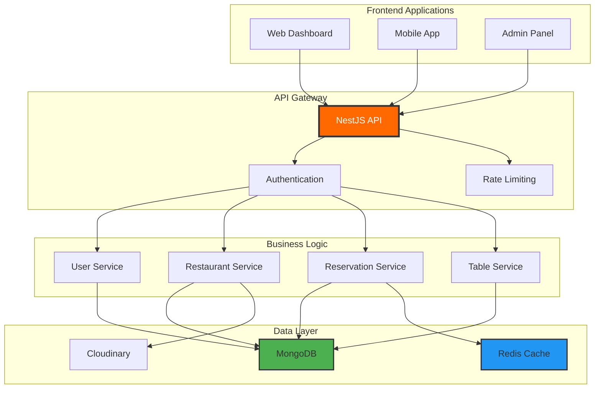
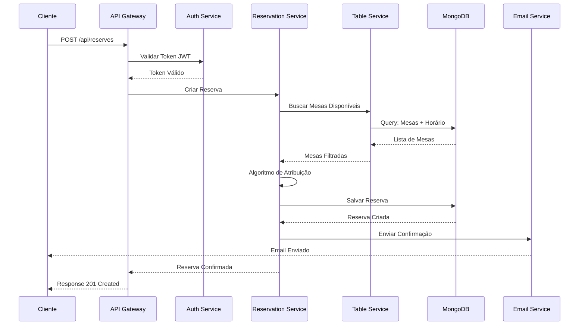
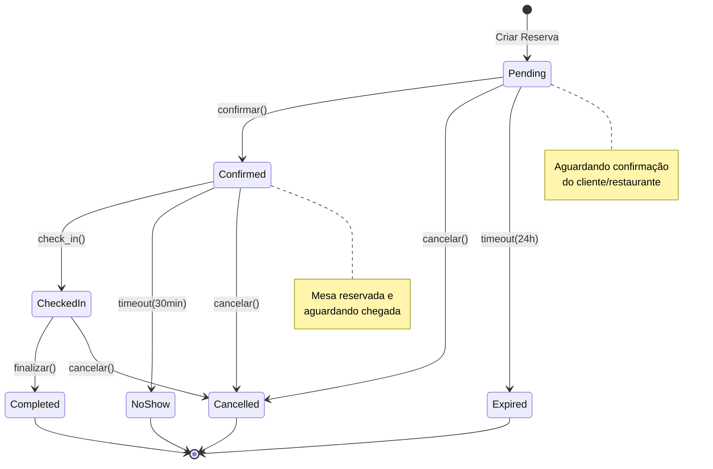
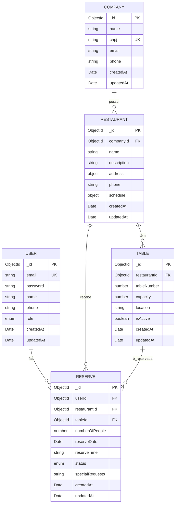
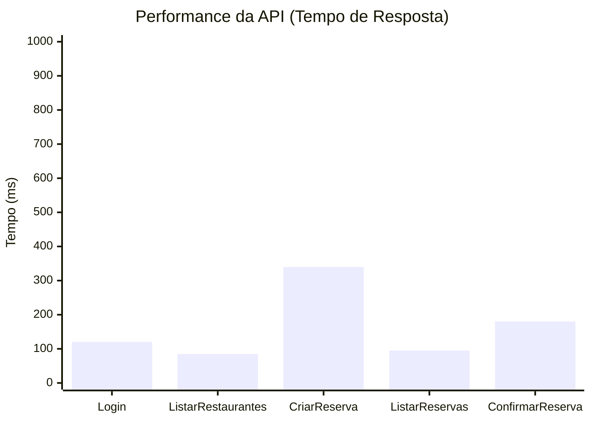
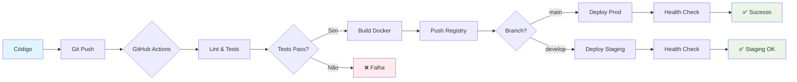
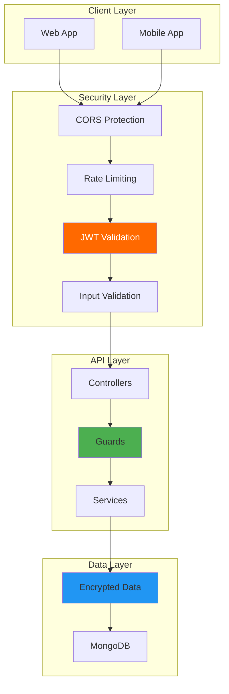
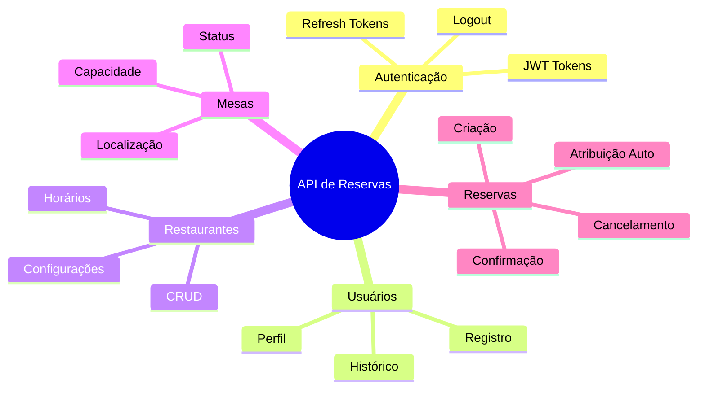

# 📊 Exemplos de Diagramas Mermaid

Este documento demonstra os diferentes tipos de diagramas Mermaid disponíveis na documentação da API de Reservas.

## 🏗️ Diagrama de Arquitetura



## 🔄 Fluxo de Criação de Reserva



## 📊 Diagrama de Estados da Reserva



## 🗄️ Diagrama Entidade-Relacionamento



## 🔄 Ciclo de Vida do Desenvolvimento

```mermaid
gitgraph
    commit id: "Initial Setup"
    branch development
    checkout development
    commit id: "User Module"
    commit id: "Auth System"
    
    branch feature/restaurants
    checkout feature/restaurants
    commit id: "Restaurant CRUD"
    commit id: "Restaurant Tests"
    
    checkout development
    merge feature/restaurants
    commit id: "Integration Tests"
    
    branch feature/reservations
    checkout feature/reservations
    commit id: "Reservation Logic"
    commit id: "Auto Assignment"
    commit id: "Email Service"
    
    checkout development
    merge feature/reservations
    commit id: "E2E Tests"
    
    checkout main
    merge development
    commit id: "v1.0.0 Release"
```

## 📈 Gráfico de Performance



## 🛠️ Pipeline de Deploy



## 🔐 Arquitetura de Segurança



## 📱 Componentes da Aplicação



---

## 🎨 Personalização de Tema

Os diagramas acima usam o tema configurado no Docusaurus:
- **Tema Claro**: `neutral`
- **Tema Escuro**: `dark`
- **Cores Personalizadas**: Laranja (#ff6900) para elementos principais

Para mais informações sobre diagramas Mermaid, consulte a [documentação oficial](https://mermaid.js.org/). 