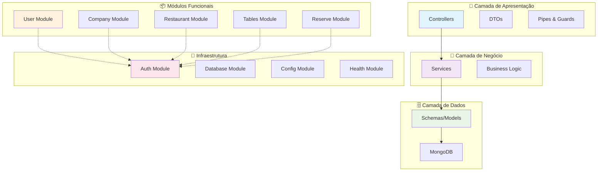
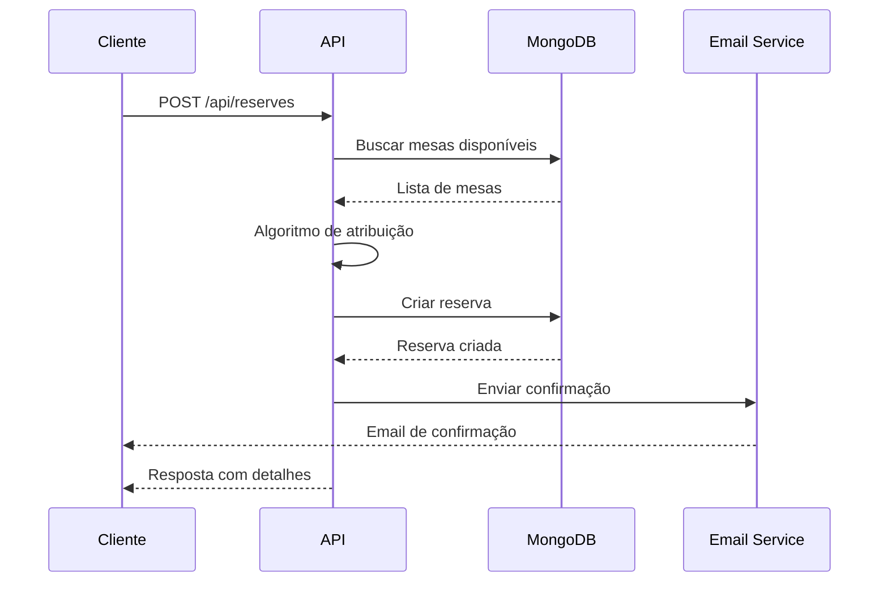

# 🏠 Introdução à API de Reservas

Bem-vindo à documentação completa da **API de Reservas**, um sistema robusto e escalável para gerenciamento de reservas de restaurantes desenvolvido com **NestJS** e **MongoDB**.

## 🎯 Visão Geral

Esta API oferece uma solução completa para restaurantes gerenciarem suas reservas, incluindo:

- 🔐 **Sistema de autenticação** com JWT
- 🏢 **Gestão de empresas e restaurantes**
- 🪑 **Gerenciamento de mesas**
- 📅 **Sistema de reservas** com atribuição automática
- 👥 **Controle de usuários** e permissões

## 🛠️ Tecnologias Principais

- **Backend**: NestJS 10.x (Node.js/TypeScript)
- **Banco de Dados**: MongoDB 6.x com Mongoose 8.x
- **Autenticação**: JWT com cookies HTTP-only
- **Upload de Arquivos**: Cloudinary
- **Documentação**: Swagger/OpenAPI
- **Testes**: Jest com cobertura completa

## 📋 Funcionalidades Principais

### Sistema de Atribuição Automática
A API implementa um algoritmo inteligente que:
- Atribui automaticamente a melhor mesa disponível
- Considera capacidade, localização e preferências
- Otimiza o uso do espaço do restaurante

### Confirmação de Reservas
- Sistema de confirmação via email
- Notificações automáticas
- Gestão de status das reservas

## 🏗️ Arquitetura do Sistema



## 📁 Estrutura do Projeto

```
src/
├── 👤 user/           # Gestão de usuários
├── 🏢 company/        # Gestão de empresas
├── 🍽️ restaurant/     # Gestão de restaurantes
├── 🪑 tables/         # Gestão de mesas
├── 📅 reserve/        # Sistema de reservas
├── 🔐 auth/           # Autenticação JWT
├── ⚕️ health/         # Health checks
└── 🔧 common/         # Utilitários compartilhados
```

## 🚀 Fluxo de Reserva



## 🔗 Links Rápidos

### Para Iniciantes
- [⚙️ Configuração do Ambiente](./getting-started/environment-setup)
- [📦 Instalação](./getting-started/installation)

### Para Desenvolvedores
- [🏗️ Estrutura de Módulos](./architecture/module-structure)
- [🗄️ Integração MongoDB](./database/mongodb-integration)
- [🔐 Sistema de Autenticação](./authentication/overview)

### Para DevOps
- [🚀 Deploy](./deployment/overview)
- [🧪 Testes](./testing/overview)

## 💡 Vantagens

✅ **Escalável**: Arquitetura modular com NestJS  
✅ **Seguro**: Autenticação JWT e validação rigorosa  
✅ **Eficiente**: Algoritmos otimizados de atribuição  
✅ **Flexível**: Configuração por ambiente  
✅ **Testável**: Cobertura completa de testes  
✅ **Documentado**: Swagger integrado  

---

**Pronto para começar?** Siga nosso [guia de instalação](./getting-started/installation) e tenha a API funcionando em minutos! 🚀 