# Estratégias de Testes

Este documento apresenta as estratégias de testes implementadas na API de Reservas, incluindo testes unitários, de integração e end-to-end.

## 🧪 Visão Geral dos Testes

A API utiliza **Jest** como framework principal de testes, seguindo a pirâmide de testes para garantir cobertura adequada e execução eficiente.

### Pirâmide de Testes

```mermaid
graph TD
    A[Testes E2E] --> B[Testes de Integração]
    B --> C[Testes Unitários]
    
    A -.-> D["• Poucos testes<br/>• Custosos<br/>• Cenários completos"]
    B -.-> E["• Testes moderados<br/>• Módulos integrados<br/>• API endpoints"]
    C -.-> F["• Muitos testes<br/>• Rápidos<br/>• Funções isoladas"]
    
    style A fill:#ffebee
    style B fill:#e8f5e8
    style C fill:#e1f5fe
```



## 🛠️ Configuração do Jest

### jest.config.js

```javascript
module.exports = {
  moduleFileExtensions: ['js', 'json', 'ts'],
  rootDir: 'src',
  testRegex: '.*\\.spec\\.ts$',
  transform: {
    '^.+\\.(t|j)s$': 'ts-jest',
  },
  collectCoverageFrom: [
    '**/*.(t|j)s',
    '!**/*.spec.ts',
    '!**/*.e2e-spec.ts',
    '!**/node_modules/**',
    '!**/dist/**',
  ],
  coverageDirectory: '../coverage',
  testEnvironment: 'node',
  coverageThreshold: {
    global: {
      branches: 80,
      functions: 80,
      lines: 80,
      statements: 80,
    },
  },
};
```

### Scripts de Teste

```json
{
  "scripts": {
    "test": "jest",
    "test:watch": "jest --watch",
    "test:cov": "jest --coverage",
    "test:debug": "node --inspect-brk -r tsconfig-paths/register -r ts-node/register node_modules/.bin/jest --runInBand",
    "test:e2e": "jest --config ./test/jest-e2e.json"
  }
}
```

## 🔬 Testes Unitários

### Estrutura de Testes de Service

```typescript
// auth-user.service.spec.ts
import { Test, TestingModule } from '@nestjs/testing';
import { getModelToken } from '@nestjs/mongoose';
import { JwtService } from '@nestjs/jwt';
import { UnauthorizedException } from '@nestjs/common';
import { AuthUserService } from './auth-user.service';
import { User } from '../schemas/user.schema';
import * as bcrypt from 'bcrypt';

describe('AuthUserService', () => {
  let service: AuthUserService;
  let mockUserModel: any;
  let mockJwtService: any;

  const mockUser = {
    _id: '507f1f77bcf86cd799439011',
    name: 'João Silva',
    email: 'joao@email.com',
    password: '$2b$10$hashed_password',
    role: 'client',
    isActive: true,
  };

  beforeEach(async () => {
    // Mock do UserModel
    mockUserModel = {
      findOne: jest.fn(),
      create: jest.fn(),
      save: jest.fn(),
    };

    // Mock do JwtService
    mockJwtService = {
      sign: jest.fn(),
      verify: jest.fn(),
    };

    const module: TestingModule = await Test.createTestingModule({
      providers: [
        AuthUserService,
        {
          provide: getModelToken(User.name),
          useValue: mockUserModel,
        },
        {
          provide: JwtService,
          useValue: mockJwtService,
        },
      ],
    }).compile();

    service = module.get<AuthUserService>(AuthUserService);
  });

  afterEach(() => {
    jest.clearAllMocks();
  });

  describe('login', () => {
    const loginDto = {
      email: 'joao@email.com',
      password: 'senha123',
    };

    it('deve retornar sessionToken para credenciais válidas', async () => {
      // Arrange
      mockUserModel.findOne.mockReturnValue({
        exec: jest.fn().mockResolvedValue(mockUser),
      });
      jest.spyOn(bcrypt, 'compare').mockResolvedValue(true);
      mockJwtService.sign.mockReturnValue('mock-jwt-token');

      // Act
      const result = await service.login(loginDto);

      // Assert
      expect(result).toEqual({ sessionToken: 'mock-jwt-token' });
      expect(mockUserModel.findOne).toHaveBeenCalledWith({ 
        email: loginDto.email 
      });
      expect(bcrypt.compare).toHaveBeenCalledWith(
        loginDto.password, 
        mockUser.password
      );
      expect(mockJwtService.sign).toHaveBeenCalledWith({
        sub: mockUser._id,
        email: mockUser.email,
        role: mockUser.role,
        name: mockUser.name,
      });
    });

    it('deve lançar UnauthorizedException para usuário não encontrado', async () => {
      // Arrange
      mockUserModel.findOne.mockReturnValue({
        exec: jest.fn().mockResolvedValue(null),
      });

      // Act & Assert
      await expect(service.login(loginDto)).rejects.toThrow(
        UnauthorizedException
      );
      expect(mockUserModel.findOne).toHaveBeenCalledWith({ 
        email: loginDto.email 
      });
    });

    it('deve lançar UnauthorizedException para senha inválida', async () => {
      // Arrange
      mockUserModel.findOne.mockReturnValue({
        exec: jest.fn().mockResolvedValue(mockUser),
      });
      jest.spyOn(bcrypt, 'compare').mockResolvedValue(false);

      // Act & Assert
      await expect(service.login(loginDto)).rejects.toThrow(
        UnauthorizedException
      );
      expect(bcrypt.compare).toHaveBeenCalledWith(
        loginDto.password, 
        mockUser.password
      );
    });

    it('deve lançar UnauthorizedException para usuário inativo', async () => {
      // Arrange
      const inactiveUser = { ...mockUser, isActive: false };
      mockUserModel.findOne.mockReturnValue({
        exec: jest.fn().mockResolvedValue(inactiveUser),
      });
      jest.spyOn(bcrypt, 'compare').mockResolvedValue(true);

      // Act & Assert
      await expect(service.login(loginDto)).rejects.toThrow(
        UnauthorizedException
      );
    });
  });

  describe('validateToken', () => {
    it('deve retornar payload para token válido', async () => {
      // Arrange
      const mockPayload = { sub: '123', email: 'test@email.com' };
      mockJwtService.verify.mockReturnValue(mockPayload);

      // Act
      const result = await service.validateToken('valid-token');

      // Assert
      expect(result).toEqual(mockPayload);
      expect(mockJwtService.verify).toHaveBeenCalledWith('valid-token');
    });

    it('deve lançar UnauthorizedException para token inválido', async () => {
      // Arrange
      mockJwtService.verify.mockImplementation(() => {
        throw new Error('Invalid token');
      });

      // Act & Assert
      await expect(service.validateToken('invalid-token')).rejects.toThrow(
        UnauthorizedException
      );
    });
  });
});
```

### Testes de Controller

```typescript
// auth-user.controller.spec.ts
import { Test, TestingModule } from '@nestjs/testing';
import { Response } from 'express';
import { AuthUserController } from './auth-user.controller';
import { AuthUserService } from './auth-user.service';
import { AuthUserDto } from './dto/auth-user.dto';

describe('AuthUserController', () => {
  let controller: AuthUserController;
  let mockAuthService: any;
  let mockResponse: Partial<Response>;

  beforeEach(async () => {
    mockAuthService = {
      login: jest.fn(),
    };

    mockResponse = {
      cookie: jest.fn(),
      status: jest.fn().mockReturnThis(),
      json: jest.fn(),
      clearCookie: jest.fn(),
    };

    const module: TestingModule = await Test.createTestingModule({
      controllers: [AuthUserController],
      providers: [
        {
          provide: AuthUserService,
          useValue: mockAuthService,
        },
      ],
    }).compile();

    controller = module.get<AuthUserController>(AuthUserController);
  });

  describe('login', () => {
    const loginDto: AuthUserDto = {
      email: 'joao@email.com',
      password: 'senha123',
    };

    it('deve realizar login e configurar cookie', async () => {
      // Arrange
      mockAuthService.login.mockResolvedValue({ 
        sessionToken: 'mock-token' 
      });

      // Act
      await controller.login(loginDto, mockResponse as Response);

      // Assert
      expect(mockAuthService.login).toHaveBeenCalledWith(loginDto);
      expect(mockResponse.cookie).toHaveBeenCalledWith(
        'sessionToken',
        'mock-token',
        expect.objectContaining({
          maxAge: 7 * 24 * 60 * 60 * 1000,
          path: '/',
          httpOnly: true,
        })
      );
      expect(mockResponse.status).toHaveBeenCalledWith(200);
      expect(mockResponse.json).toHaveBeenCalledWith({
        message: expect.any(String),
      });
    });
  });
});
```

## 🔗 Testes de Integração

### Configuração do Teste de Integração

```typescript
// reserve.integration.spec.ts
import { Test, TestingModule } from '@nestjs/testing';
import { INestApplication } from '@nestjs/common';
import { MongooseModule } from '@nestjs/mongoose';
import { JwtModule } from '@nestjs/jwt';
import * as request from 'supertest';
import { ReserveModule } from './reserve.module';
import { UserModule } from '../user/user.module';

describe('Reserve Integration Tests', () => {
  let app: INestApplication;
  let jwtToken: string;
  let restaurantId: string;
  let userId: string;

  beforeAll(async () => {
    const moduleFixture: TestingModule = await Test.createTestingModule({
      imports: [
        MongooseModule.forRoot('mongodb://localhost:27017/reservas-test'),
        JwtModule.register({
          secret: 'test-secret',
          signOptions: { expiresIn: '1h' },
        }),
        ReserveModule,
        UserModule,
      ],
    }).compile();

    app = moduleFixture.createNestApplication();
    await app.init();

    // Setup: Criar usuário e obter token
    const loginResponse = await request(app.getHttpServer())
      .post('/auth-user/login')
      .send({
        email: 'test@email.com',
        password: 'senha123',
      });

    jwtToken = loginResponse.body.sessionToken;
  });

  afterAll(async () => {
    await app.close();
  });

  describe('/reserve (POST)', () => {
    it('deve criar uma nova reserva', async () => {
      const createReserveDto = {
        restaurantId,
        customerName: 'João Silva',
        customerEmail: 'joao@email.com',
        date: '2024-12-25',
        time: '19:30',
        numberOfPeople: 4,
      };

      const response = await request(app.getHttpServer())
        .post('/reserve')
        .set('Cookie', `sessionToken=${jwtToken}`)
        .send(createReserveDto)
        .expect(201);

      expect(response.body.data).toMatchObject({
        customerName: createReserveDto.customerName,
        customerEmail: createReserveDto.customerEmail,
        numberOfPeople: createReserveDto.numberOfPeople,
        status: 'pending',
      });
      expect(response.body.data.tableId).toBeDefined();
    });

    it('deve retornar 409 quando não há mesas disponíveis', async () => {
      // Primeiro, criar reservas para ocupar todas as mesas
      // ...

      const createReserveDto = {
        restaurantId,
        customerName: 'Maria Santos',
        customerEmail: 'maria@email.com',
        date: '2024-12-25',
        time: '19:30',
        numberOfPeople: 4,
      };

      await request(app.getHttpServer())
        .post('/reserve')
        .set('Cookie', `sessionToken=${jwtToken}`)
        .send(createReserveDto)
        .expect(409);
    });
  });

  describe('/reserve/availability/:restaurantId (GET)', () => {
    it('deve retornar horários disponíveis', async () => {
      const response = await request(app.getHttpServer())
        .get(`/reserve/availability/${restaurantId}`)
        .query({
          date: '2024-12-26',
          numberOfPeople: 2,
        })
        .expect(200);

      expect(response.body.data).toHaveProperty('availableSlots');
      expect(response.body.data.availableSlots).toBeInstanceOf(Array);
    });
  });
});
```

## 🎯 Testes End-to-End (E2E)

### Configuração E2E

```typescript
// test/app.e2e-spec.ts
import { Test, TestingModule } from '@nestjs/testing';
import { INestApplication, ValidationPipe } from '@nestjs/common';
import { MongooseModule } from '@nestjs/mongoose';
import * as request from 'supertest';
import * as cookieParser from 'cookie-parser';
import { AppModule } from '../src/app.module';

describe('Reservas API (e2e)', () => {
  let app: INestApplication;
  let server: any;

  beforeAll(async () => {
    const moduleFixture: TestingModule = await Test.createTestingModule({
      imports: [AppModule],
    })
    .overrideModule(MongooseModule)
    .useModule(
      MongooseModule.forRoot('mongodb://localhost:27017/reservas-e2e-test')
    )
    .compile();

    app = moduleFixture.createNestApplication();
    
    // Configurar pipes e middlewares como na aplicação real
    app.useGlobalPipes(new ValidationPipe());
    app.use(cookieParser());
    app.enableCors({
      origin: true,
      credentials: true,
    });

    await app.init();
    server = app.getHttpServer();
  });

  afterAll(async () => {
    await app.close();
  });

  describe('Fluxo Completo de Reserva', () => {
    let sessionCookie: string;
    let reserveId: string;
    let restaurantId: string;

    it('1. Deve fazer login do usuário', async () => {
      const response = await request(server)
        .post('/api/auth-user/login')
        .send({
          email: 'admin@restaurant.com',
          password: 'senha123',
        })
        .expect(200);

      sessionCookie = response.headers['set-cookie'][0];
      expect(sessionCookie).toContain('sessionToken');
    });

    it('2. Deve criar uma nova reserva', async () => {
      const response = await request(server)
        .post('/api/reserve')
        .set('Cookie', sessionCookie)
        .send({
          restaurantId: '507f1f77bcf86cd799439011',
          customerName: 'Teste E2E',
          customerEmail: 'e2e@test.com',
          date: '2024-12-30',
          time: '20:00',
          numberOfPeople: 2,
        })
        .expect(201);

      reserveId = response.body.data.id;
      expect(response.body.data.status).toBe('pending');
    });

    it('3. Deve confirmar a reserva pelo restaurante', async () => {
      await request(server)
        .patch(`/api/reserve/confirm/restaurant/${reserveId}`)
        .set('Cookie', sessionCookie)
        .expect(200);
    });

    it('4. Deve confirmar a reserva pelo cliente', async () => {
      const response = await request(server)
        .patch(`/api/reserve/confirm/client/${reserveId}`)
        .set('Cookie', sessionCookie)
        .expect(200);

      expect(response.body.data.status).toBe('confirmed');
    });

    it('5. Deve buscar a reserva confirmada', async () => {
      const response = await request(server)
        .get(`/api/reserve/${reserveId}`)
        .set('Cookie', sessionCookie)
        .expect(200);

      expect(response.body.data.status).toBe('confirmed');
      expect(response.body.data.confirmation.clientConfirmed).toBe(true);
      expect(response.body.data.confirmation.restaurantConfirmed).toBe(true);
    });
  });
});
```

## 📊 Mocks e Helpers

### Database Mock Helper

```typescript
// test/helpers/database.helper.ts
import { MongoMemoryServer } from 'mongodb-memory-server';
import { Connection } from 'mongoose';

export class DatabaseHelper {
  private static mongod: MongoMemoryServer;

  static async startDatabase(): Promise<string> {
    this.mongod = await MongoMemoryServer.create();
    return this.mongod.getUri();
  }

  static async stopDatabase(): Promise<void> {
    if (this.mongod) {
      await this.mongod.stop();
    }
  }

  static async clearDatabase(connection: Connection): Promise<void> {
    const collections = connection.collections;
    for (const key in collections) {
      const collection = collections[key];
      await collection.deleteMany({});
    }
  }
}
```

### Auth Helper

```typescript
// test/helpers/auth.helper.ts
import { JwtService } from '@nestjs/jwt';

export class AuthHelper {
  static generateTestToken(payload: any): string {
    const jwtService = new JwtService({
      secret: 'test-secret',
    });
    return jwtService.sign(payload);
  }

  static createTestUser() {
    return {
      _id: '507f1f77bcf86cd799439011',
      name: 'Test User',
      email: 'test@email.com',
      role: 'client',
    };
  }
}
```

## 🚀 Executando os Testes

### Comandos Básicos

```bash
# Executar todos os testes
yarn test

# Executar testes em modo watch
yarn test:watch

# Executar testes com coverage
yarn test:cov

# Executar testes E2E
yarn test:e2e

# Executar testes específicos
yarn test auth-user.service.spec.ts

# Executar testes em modo debug
yarn test:debug
```

### Coverage Report

```bash
# Gerar relatório de cobertura
yarn test:cov

# Abrir relatório em HTML
open coverage/lcov-report/index.html
```

### Métricas de Qualidade

#### Metas de Cobertura

| Métrica | Meta | Atual |
|---------|------|-------|
| Statements | 80% | 85% |
| Branches | 80% | 82% |
| Functions | 80% | 88% |
| Lines | 80% | 85% |

## 🔍 Boas Práticas

### 1. Nomenclatura de Testes

```typescript
describe('AuthUserService', () => {
  describe('login', () => {
    it('deve retornar sessionToken para credenciais válidas', () => {});
    it('deve lançar UnauthorizedException para usuário não encontrado', () => {});
    it('deve lançar UnauthorizedException para senha inválida', () => {});
  });
});
```

### 2. Organização dos Testes

```
src/
├── modules/
│   ├── user/
│   │   ├── auth-user.service.ts
│   │   ├── auth-user.service.spec.ts
│   │   ├── auth-user.controller.ts
│   │   └── auth-user.controller.spec.ts
└── test/
    ├── fixtures/
    ├── helpers/
    └── e2e/
```

### 3. Mocks Eficientes

```typescript
// Mock apenas o que é necessário
const mockUserModel = {
  findOne: jest.fn(),
  // Não mockar métodos não utilizados
};

// Usar spies para métodos externos
jest.spyOn(bcrypt, 'compare').mockResolvedValue(true);
```

## 🚀 Próximos Passos

- [Deployment](../deployment/overview)
<!-- - [Monitoramento](../monitoring/overview) -->
<!-- - [Segurança](../security/best-practices) -->

## 📚 Links Relacionados

<!-- - [Monitoramento](../monitoring/overview) -->
<!-- - [Segurança e Boas Práticas](../security/best-practices) -->

### Recursos Externos

- [Documentação Jest](https://jestjs.io/docs/getting-started)
- [Testing NestJS](https://docs.nestjs.com/fundamentals/testing) 