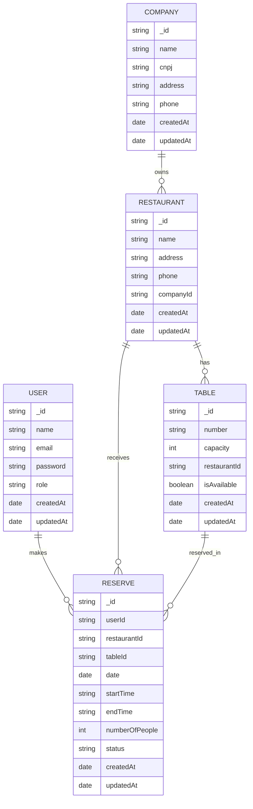

```mermaid
erDiagram
    USER {
        string _id
        string name
        string email
        string password
        string role
        date createdAt
        date updatedAt
    }

    COMPANY {
        string _id
        string name
        string cnpj
        string address
        string phone
        date createdAt
        date updatedAt
    }

    RESTAURANT {
        string _id
        string name
        string address
        string phone
        string companyId
        date createdAt
        date updatedAt
    }

    TABLE {
        string _id
        string number
        int capacity
        string restaurantId
        boolean isAvailable
        date createdAt
        date updatedAt
    }

    RESERVE {
        string _id
        string userId
        string restaurantId
        string tableId
        date date
        string startTime
        string endTime
        int numberOfPeople
        string status
        date createdAt
        date updatedAt
    }

    USER ||--o{ RESERVE : makes
    COMPANY ||--o{ RESTAURANT : owns
    RESTAURANT ||--o{ TABLE : has
    RESTAURANT ||--o{ RESERVE : receives
    TABLE ||--o{ RESERVE : reserved_in
```