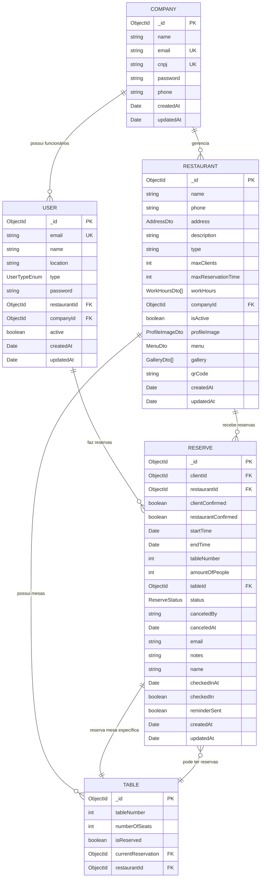

# Diagrama Entidade-Relacionamento (ER) - Sistema Reserva Fácil

## Descrição dos Relacionamentos

- **COMPANY ↔ USER**: Uma empresa pode ter vários funcionários/usuários (1:N)
- **COMPANY ↔ RESTAURANT**: Uma empresa pode gerenciar vários restaurantes (1:N)  
- **USER ↔ RESERVE**: Um usuário pode fazer várias reservas (1:N)
- **RESTAURANT ↔ TABLE**: Um restaurante possui várias mesas (1:N)
- **RESTAURANT ↔ RESERVE**: Um restaurante pode receber várias reservas (1:N)
- **TABLE ↔ RESERVE**: Uma mesa pode ter várias reservas em diferentes horários (1:N)
- **RESERVE ↔ TABLE**: Uma reserva específica ocupa uma mesa específica (N:1)

## Enums e Tipos Especiais

- **UserTypeEnum**: `'admin' | 'worker' | 'user' | 'company'`
- **ReserveStatus**: `'Pendente' | 'Confirmada' | 'Cancelada'`
- **AddressDto**: Objeto contendo dados do endereço
- **WorkHoursDto**: Array de horários de funcionamento por dia da semana
- **ProfileImageDto**: Dados da imagem de perfil do restaurante
- **MenuDto**: Cardápio do restaurante
- **GalleryDto**: Galeria de fotos do restaurante 